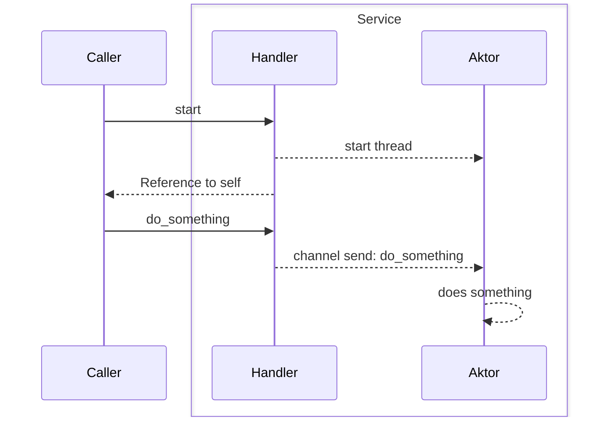
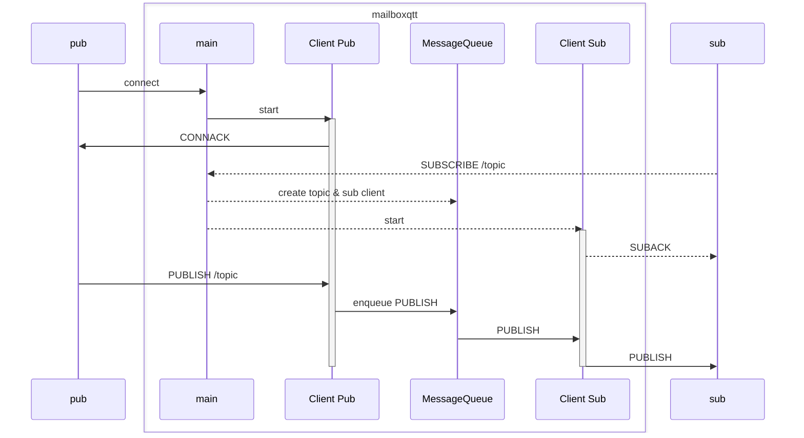

# mailboxqtt
A primitive MQTT broker written entirely from scratch in rust.
Created as part of an IoT lecture at DHBW.

## feature set
- [x] Threading for non-blocking connections
- [x] connections
- [x] publishing messages to topics
- [x] subscribing to topics
- [ ] QoS

## Example Usage
Start the broker with:
```
cargo run
```
(I have not created any deployment yet but I'll create a docker at some point)

Then use an mqtt client like [Mosquitto](https://mosquitto.org/download/) to communicate with the broker:
```bash
mosquitto_sub -h 127.0.0.1 -p 1883 -t test -i "test-sub"
```
Then, in another terminal:
```bash
mosquitto_pub -h 127.0.0.1 -p 1883 -t test -m "hello world" -i "test-pub"
```
You should see the message "hello world" appear in your subscriber's terminal.


## Architecture
The broker consists of four main thread types:
1. A singleton Message Queue thread, which is responsible for remembering subscribers to topics, and holding a queue of messages (which is modelled by an UnboundedReceiver).
2. A singleton main thread holding a reference to the Message Queue, accepts TCP connections and spawns 3. Client Threads:
3. Client Threads: For each TCP client, a new thread is opened to provide unblocking connections. There may be arbitrarily many client threads.
4. One TcpWriter thread for each Client. These threads are the only ones with write permissions to the TCP stream.

Note that the individual threads communicate with each other through an actor pattern: Every thread comes with its own Handler (e.g. `Client` and `ClientHandler`). The Handler is a reference to the actor and exposes public interface methods; these communicate through a thread-safe UnboundedChannel (rust thread-communication magic) with their respective Actor, which runs in its own thread and performs actions:



(don't mind the alternate spelling of Aktor - 'Actor' is a reserved keyword in mermaid)

Here have some sequence diagram that's probably only 90% correct:


(currently, all QoS is treated as QoS 0 so there's no PUBACKs)
